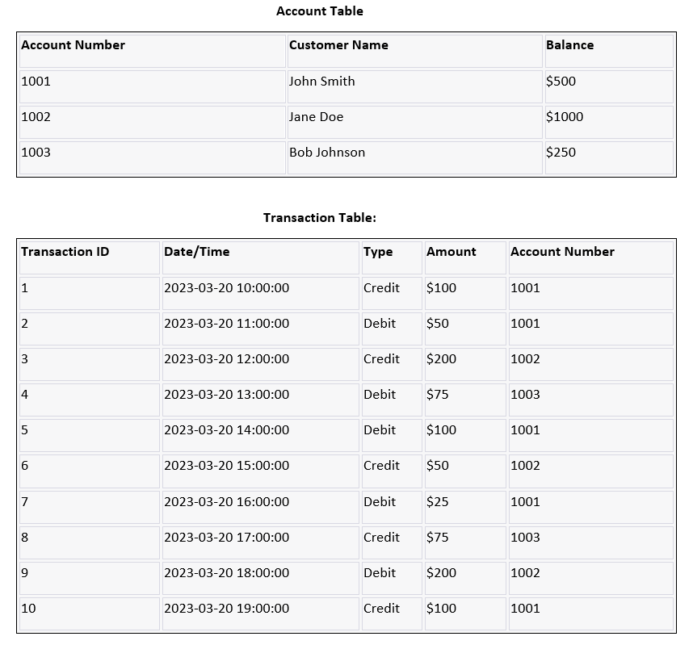
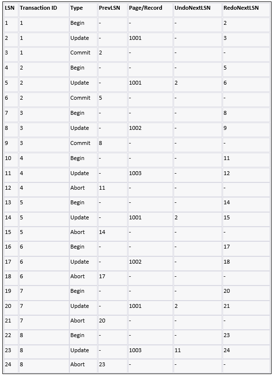

# Question 1 Answer

Data Loss Situation: Suppose, lets say there are couple of transactions (say 10 transactions) happened to  transfer amount from one account to the other. These transactions are happening on Account and Transaction Tables.


Now let's assume that a system failure occurs after transaction ID 7 has been committed,
but before transaction ID 8 could be committed.
Here's how we would apply the ARIES recovery algorithm to restore the database to a consistent state:
Analysis Phase:
The analysis phase determines which transactions were committed before the system failure and which transactions were in progress but not yet committed. In this case, transactions 1 through 7 were committed, and transactions 8 through 10 were in progress but not yet committed.
Redo Phase:
In the redo phase, we apply all committed transactions to the database. This involves replaying the changes made by each transaction. For example, transaction 1 added $100 to account 1001, so we would update the account balance to $600.
Undo Phase:
In the undo phase, we undo any uncommitted transactions that were in progress at the time of the system failure. This involves reversing the changes made by each transaction. For example, transaction 8 subtracted $75 from account 1003, so we would add $75 back to the account balance.
Redo Phase (again):
In the redo phase (again), we reapply any transactions that were partially undone in the previous phase. This is necessary because some transactions may have been only partially undone before the system failure occurred. In this case, no partial undos were necessary.

Here's an example of how the log table might look like in the banking scenario with sample entries we discussed earlier, assuming that the database uses the ARIES recovery algorithm and a write-ahead logging:


In this scenario, transactions 4, 5, 6, and 7 have failed and been aborted, so the log records for those transactions have an "Abort" operation type instead of "Commit". The UndoNextLSN column points to the next log record that needs to be undone during the undo phase of the recovery process.
For example, for Transaction 1, the UndoNextLSN is 2, which means that the log record with LSN 2 needs to be undone first during the undo phase. The RedoNextLSN column points to the next log record that needs to be redone during the redo phase of the recovery process. For Transaction 1, the RedoNextLSN is 3, which means that the log record with LSN 3 needs to be redone first during the redo phase.
During the recovery process, the system would start with the last checkpoint and scan the log backwards, undoing the changes made by the failed transactions by following the UndoNextLSN pointers. Once the undo phase is complete, the system would then scan the log forwards, redoing any changes that were made by the successful transactions but not yet written to disk, by following the RedoNextLSN pointers. Once the redo phase is complete, the system would then bring the database back to a consistent state and allow normal transactions to resume.

# Question 2 Answer

## Database Connection
```{r}
library(RSQLite)

# Connect to Sakila database
con <- dbConnect(RSQLite::SQLite(), dbname = "sakila.db")
```

## Drop and Create Journal Table to track Transactions
```{r}
dbExecute(con, "DROP TABLE IF EXISTS journal;")
dbExecute(con, "CREATE TABLE IF NOT EXISTS journal 
(transaction_id INTEGER PRIMARY KEY, table_name TEXT, row_id INTEGER, 
old_value TEXT, new_value TEXT, timestamp DATETIME)")

```
## Transaction 1
```{r}
#Begin the transaction
dbExecute(con, "BEGIN TRANSACTION")
```
Values before update to payment and address table
```{sql, connection=con}
SELECT amount from payment WHERE customer_id = 130 and rental_id=1;
```
```{sql, connection=con}
SELECT phone from address  WHERE address_id = 3;
```
## Updates for Transaction 1
Changing Amount to 6.99 from 2.99 in payment table
Changing phone number from 14033335568 to 1873343014
Also insert the same in journal Table. 
### Transaction 1 successful- so commit
Committing the transactions to the table permanently as the transaction was successful.
To Test the transaction, txnFailed this flag is used
```{r}
# Update customer payment information and track in journal
txnFailed<- FALSE
ps<-dbSendStatement(con, "UPDATE payment 
          SET amount = 6.99 
          WHERE customer_id = 130 AND rental_id=1 ;")
if (dbGetRowsAffected(ps) < 1)
    txnFailed = TRUE
  dbClearResult(ps)
ps<-dbSendStatement(con, "UPDATE address 
          SET phone = '1873343014' 
          WHERE address_id = 3")
if (dbGetRowsAffected(ps) < 1)
    txnFailed = TRUE
  dbClearResult(ps)
dbExecute(con, "INSERT INTO journal 
          (table_name, row_id, old_value, new_value, timestamp) 
          VALUES ('payment', 1, '2.99', '6.99', datetime('now'));")
dbExecute(con, "INSERT INTO journal 
          (table_name, row_id, old_value, new_value, timestamp) 
          VALUES ('address', 1, '14033335568', '1873343014', datetime('now'));")


if (!txnFailed) {
  print("Transaction was successful")
  dbExecute(con, "COMMIT TRANSACTION")

} else {
  print("Transaction failed")
  dbRollback(con)
}

```
Updates have happened properly as the query got executed without any error
Values after update to payment and address table
```{sql, connection=con}
SELECT amount from payment WHERE customer_id = 130 and rental_id=1;
```
```{sql, connection=con}
SELECT phone from address  WHERE address_id = 3;
```

We can also see the Journal was updated 
properly with the respective changes.
```{r}
# Select journal entries for the transaction
journal_results <- dbGetQuery(con, "SELECT * FROM journal")

# Print journal entries
print(journal_results)

```
## Transaction 2

Begin New Transaction to demonstrate RollBack during transaction failure
```{r}
#Begin the transaction
dbExecute(con, "BEGIN TRANSACTION")
```
## Updates for Transaction 2 
Update the payment from 6.99 to 100
```{r}
# Update customer payment information and track in journal
txnFailed<- FALSE
ps<-dbSendStatement(con, "UPDATE payment 
          SET amount = 100
          WHERE customer_id = 130 AND rental_id=1 ;")
if (dbGetRowsAffected(ps) < 1)
    txnFailed = TRUE
  dbClearResult(ps)
ps<- dbSendStatement(con, "INSERT INTO journal 
          (table_name, row_id, old_value, new_value, timestamp) 
          VALUES ('payment', 1, '6.99', '100', datetime('now'));")

```
Check if updates happened
```{sql, connection=con}
select amount from payment where customer_id = 130 AND rental_id=1;
```
Check if Journal Table has been inserted with tranaction_id 3
```{r}
# Select journal entries for the failed transaction
journal_results <- dbGetQuery(con, "SELECT * FROM journal")

# Print journal entries
print(journal_results)

```

Trying to update address_id for 7777 which is not there in the table. So this will not return any rows. 
Hence this transaction should fail.
```{r comment= "commets" }
txnFailed<- FALSE
ps<-dbSendStatement(con, "UPDATE address SET phone = '187334301599' WHERE address_id = 7777")
if (dbGetRowsAffected(ps) < 1)
    txnFailed = TRUE
  dbClearResult(ps)
dbExecute(con, "INSERT INTO journal 
          (table_name, row_id, old_value, new_value, timestamp) 
          VALUES ('address', 1, '1873343014', '187334301599', datetime('now'));")
```


## Transaction 2 unsuccessful- so rollback

Now we have to rollback this transaction as the previous update 
in payments table should not be committed to the db.
Check if the transaction was successful, and the amount should still be 6.99 
as we rolled back so it should ideally say Transaction Failed
```{r}
# Test the transaction
# Select payment information
if (!txnFailed) {
  print("Transaction was successful")
  dbExecute(con, "COMMIT TRANSACTION")
} else {
  print("Transaction failed")
  dbRollback(con)
}

```
Check if rollback has happened, Amount should be 6.99
```{sql, connection=con}
select amount from payment where customer_id = 130 AND rental_id=1;
```
Also check no inserts happened to journal Table (ie)
transaction_id 3 should have also been roll backed.
```{r}
# Select journal entries for the failed transaction
journal_results <- dbGetQuery(con, "SELECT * FROM journal")

# Print journal entries
print(journal_results)

```
Closing the DB
```{r}
# Close connection
dbDisconnect(con)
```